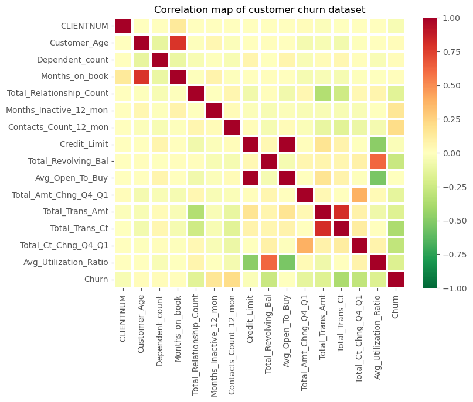
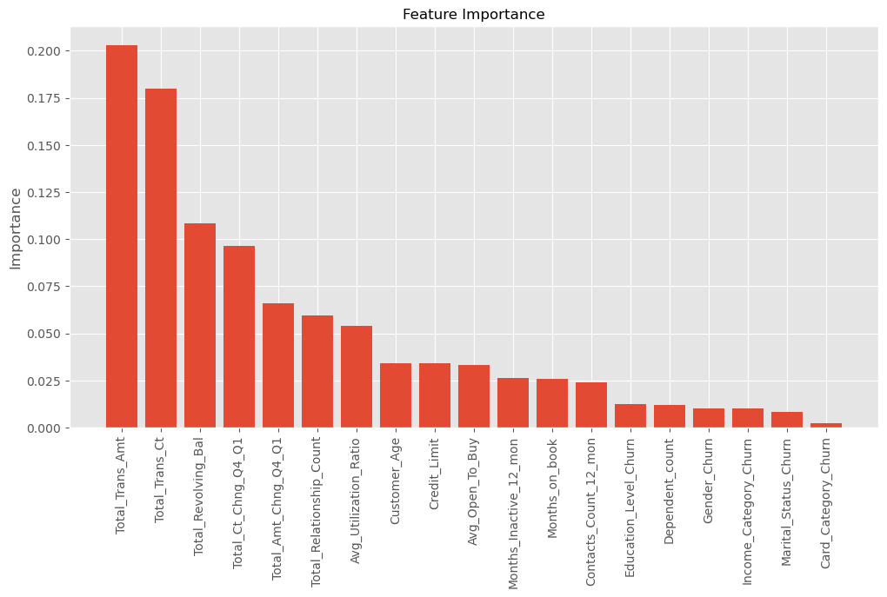

# ML DevOps Engineer Nanodegree Udacity - 1/4 - *Predict Customer Churn*

## 1. Project Description

Project **Predict Customer Churn** of ML DevOps Engineer Nanodegree Udacity. Goal is to refactor coding work on customer churn prediction - identifying users with the highliest likelihood of leaving your customer base - into more production-friendly standards (script quality, logging, testing), i.e moving away from user-friendly but messy Jupyter Notebooks into standard Python scripts.

## 2. Checklist

- [x] PEP 8-compliant scripts (score of 7.38/10 for `churn_library.py` and 7.5/10 for `churn_script_logging_and_tests.py`)
- [x] Contains Project README
- [x] Document strings for functions and Python modules
- [x] Tests for each function
- [x] Logs storing errors and info in `.log` files (which can be launched via the command line)
- [x] EDA/results plots and serialized models stored in `results`
- [x] `churn_library.py` follows main Data Science steps (EDA, Feature Engineering, Training, Prediction, Evaluation)
- [x] Categorical columns handled with mean encoding

## 3. Files and data description

File structure:

- `data`
    - `bank_data.csv`
- `logs`
    - `churn_library.log`
    - `churn_library_test.log`
- `models`
- `images`
    - `eda`
    - `results`
- `churn_library.py`
- `churn_script_logging_and_tests.py`
- `churn_notebook.ipynb`
- `README.md`
- `requirements_py3.8.txt`

The dataset required for running all the Python scripts is located in the folder `data` under `bank_data.csv`. It can also be found on [Kaggle](https://www.kaggle.com/datasets/mathchi/churn-for-bank-customers) or is provided in the ML DevOps Engineer Nanodegree.

This dataset contains information on customer churn behavior, including transaction/consumption behavior and socio-economic status. We are trying to predict likelihood of customer churn through 19 explanatory variables:



The percentage of customer churn is low (less than 10%) but we can still train machine learining models in order to predict the likelihood of churn and also evalute which of the 19 explanatory variables are the most likely to correlate with the willingness to churn.

## 4. Results

After running different models and obtaining decent performance with Random Forests on the testing set (ROC AUC of 99%, meaning almost perfect ability to distinguish loyal customers from demotivated customers), we find that **customer spending amounts are the explanatory variables that correlate the most with customer churn**. This makes sense: after all, highly active customers making many purchases are unlikely to be unsatisfied to the point of churn. 



## 5. Running Files

Moving into the cloned repository:

```
cd [PATH_TO_CLONED_REPOSITORY]/project_1_customer_churn
```

Assuming you are using the Anaconda distribution for all package and Python environment management, run the following command (with the Anaconda prompt) to install all the relevant dependencies:

```
conda env create --name customer_churn --file requirements_py3.8.txt python=3.8
```

Switch to conda environment by running:

```
conda activate customer_churn
```

Then run the following command to generate EDA images, train models and output results (this took 20 minutes to complete):

```
python churn_library.py data/bank_data.csv
```

For running tests:

```
python churn_script_logging_and_tests.py
```